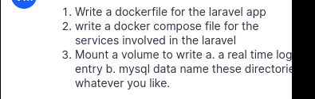
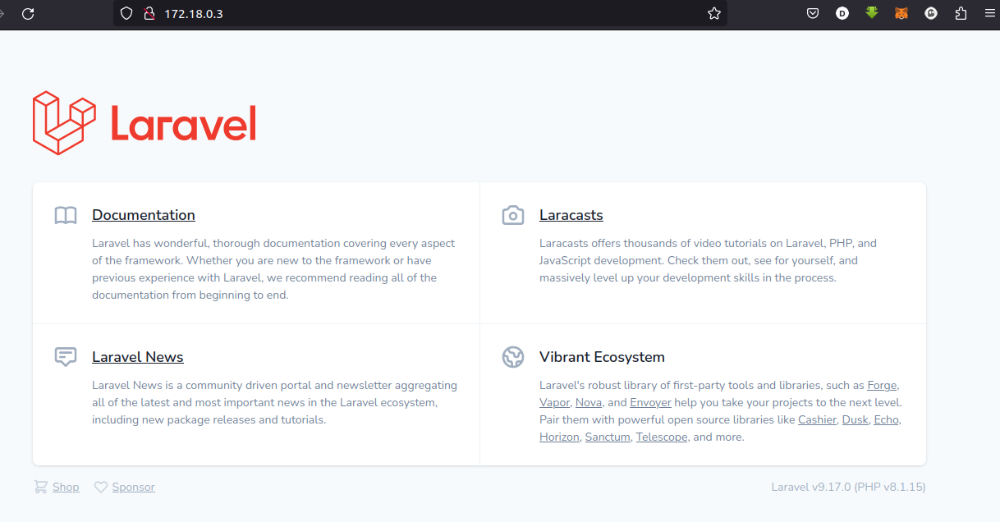
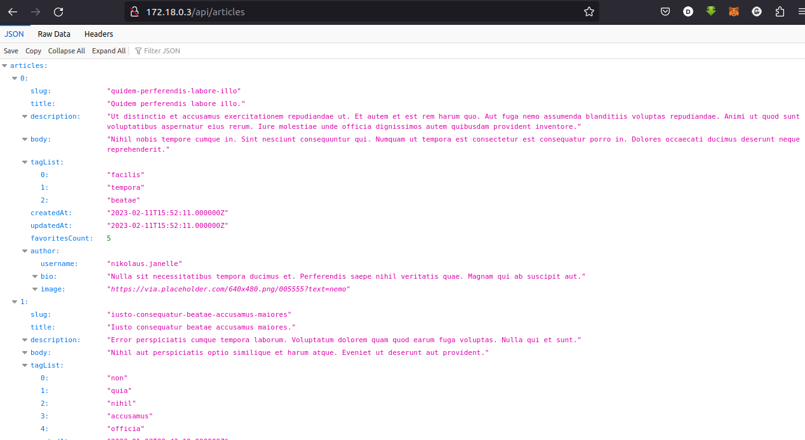

# Docker

This mini project is a hands on task to demontsrate knowldege of docker technology.

## Deployed App (Local Environment)

  

To replicate this in your local setup.

- Clone this repo
- cd into project folder path
- execute <docker build -t laraimage:latest .> so as to have docker build the image locally. If you change the image name or tag, you also have to make changes in docker-compose.yml
- execute <docker-compose -f docker-compose.yml up> to get the conatiners running
- allow the database container to get fully set up then open another terminal and execute the following commands
- <docker exec -it app bash>
- <php artisan migrate>
- <php artisan migrate --seed>
- <service apache2 start>

## Security Fixes

The database url details (such as name and password) should be passed in a safe way. This setup shouldn't be deployed into a production environment without making these fixes.

## Bug

I had some pretty code commits (this project made me remember why tech can be so frustrating). AN unreasonable number of hours went into researching why my app couldn't connect with my mysql server.
Fix - the server name in laravel.conf was not reflecting the database service parameter in docker-compose.yml hence why my app could not connect with my database.
